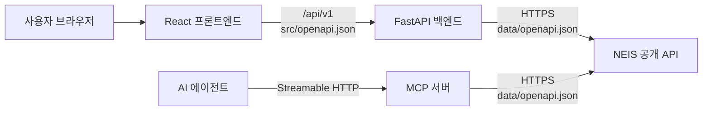

# 급식 배틀 - 학교 급식 조회 앱 기술 요구사항

## 1. 문서 개요

### 1.1 목적

이 문서는 승인된 `PRD.md`를 구현하기 위한 기술 구조, 컴포넌트 책임, 프론트엔드와 백엔드 간 OpenAPI 계약, NEIS 및 MCP 연동 방식, 실행 환경 및 테스트 전략을 정의한다.

### 1.2 기술 목표

- 급식 조회와 급식 배틀을 독립된 화면 및 API 흐름으로 구현한다.
- 브라우저가 NEIS API를 직접 호출하지 않게 해 API 키와 외부 API 세부 구조를 보호한다.
- 프론트엔드와 백엔드는 `src/openapi.json`을 단일 통신 계약으로 사용한다.
- 외부 NEIS API의 필드와 오류를 내부 도메인 모델로 정규화한다.
- Docker Compose 한 번으로 전체 애플리케이션과 E2E 테스트 환경을 재현할 수 있게 한다.

## 2. 시스템 아키텍처



### 2.1 구성 요소

| 구성 요소 | 책임 |
|---|---|
| React 프론트엔드 | 화면 렌더링, 사용자 입력 검증, 조회·배틀 흐름 및 상태 관리, 접근성 제공 |
| FastAPI 백엔드 | 내부 REST API 제공, 입력 검증, NEIS API 호출, 응답 정규화, 오류 변환 |
| MCP 서버 | AI 에이전트용 학교 검색 및 중식 조회 도구 제공, MCP 오류 변환 |
| `src/openapi.json` | 프론트엔드와 백엔드 사이의 내부 API 계약 |
| `data/openapi.json` | 백엔드와 NEIS 공개 API 사이의 외부 API 계약 |
| Docker Compose | 프론트엔드, 백엔드와 MCP 서버의 빌드, 네트워크 및 실행 환경 오케스트레이션 |

### 2.2 통신 원칙

- 프론트엔드는 같은 오리진의 `/api/v1` 경로만 호출한다.
- 프론트엔드는 NEIS 호스트나 NEIS API 키를 알 수 없어야 한다.
- 백엔드는 HTTPS로만 NEIS API를 호출한다.
- 내부 API는 JSON을 사용하며 문자 인코딩은 UTF-8이다.
- 내부 JSON 필드명은 `camelCase`, Python 내부 모델은 `snake_case`를 사용하고 Pydantic alias로 변환한다.
- 모든 날짜는 내부 API에서 ISO 8601 달력 날짜 형식인 `YYYY-MM-DD`를 사용한다.
- “오늘”, 이번 달 및 직전 달은 서버와 클라이언트 모두 `Asia/Seoul` 시간대를 기준으로 계산한다.
- 외부 NEIS 요청 직전에 날짜를 `YYYYMMDD`로 변환한다.

## 3. 기술 스택

### 3.1 프론트엔드

| 영역 | 기술 | 사용 목적 |
|---|---|---|
| 언어 | TypeScript `strict` | 컴파일 시 타입 안전성 |
| UI 런타임 | React | 컴포넌트 기반 UI |
| 빌드 도구 | Vite | 개발 서버 및 프로덕션 번들 |
| 라우팅 | React Router | 급식 조회와 급식 배틀 화면 분리 |
| 서버 상태 | TanStack Query | 요청, 로딩, 오류, 재시도 및 캐시 관리 |
| 달력 | React DayPicker | 날짜 범위 및 단일 날짜 선택, 키보드 접근성 |
| UI 기반 | Fluent UI React Components | 접근 가능한 기본 컴포넌트 |
| 스타일 | CSS Modules + CSS Custom Properties | 학교 스포츠 중계형 테마와 반응형 레이아웃 |
| API 타입 | `openapi-typescript` | `src/openapi.json`에서 TypeScript 타입 생성 |

React DayPicker는 급식 조회 화면에서 `range` 모드의 Date Range Picker로, 급식 배틀 화면에서 `single` 모드의 Date Picker로 사용한다. 두 화면은 같은 래퍼 컴포넌트를 재사용하되 선택 상태는 공유하지 않는다.

### 3.2 백엔드

| 영역 | 기술 | 사용 목적 |
|---|---|---|
| 언어 | Python 3.12 이상 | 백엔드 구현 |
| 패키지·프로젝트 관리 | uv | 의존성 선언, 잠금, 가상 환경 동기화 및 명령 실행 |
| API 프레임워크 | FastAPI | REST API와 OpenAPI 호환 요청·응답 처리 |
| 데이터 검증 | Pydantic v2 | 내부 스키마 및 환경 변수 검증 |
| HTTP 클라이언트 | HTTPX AsyncClient | 비동기 NEIS API 호출 |
| 설정 | pydantic-settings | 환경 변수 기반 설정 |
| 실행 서버 | Uvicorn | ASGI 애플리케이션 실행 |

배틀 API는 두 학교의 NEIS 요청을 `asyncio.gather`로 병렬 실행한다. 한 요청의 실패를 데이터 없음으로 바꾸지 않으며, 외부 API 실패는 명시적인 게이트웨이 오류로 반환한다.

#### 3.2.1 Python 패키지 관리 및 앱 실행

- `backend/pyproject.toml`을 Python 버전, 런타임 의존성, 개발 의존성 및 도구 설정의 단일 원본으로 사용한다.
- `backend/uv.lock`을 버전 관리하고 로컬 개발, CI 및 컨테이너 빌드에서 동일한 잠금 파일을 사용한다.
- 개발 환경은 `backend/`에서 `uv sync --all-groups`로 생성·동기화한다. `uv`가 관리하는 `.venv`는 버전 관리하지 않는다.
- 의존성은 `uv add <package>`, 개발 전용 의존성은 `uv add --dev <package>`로 변경하고, `uv pip install`이나 별도 `requirements.txt`를 사용하지 않는다.
- 로컬 개발 서버는 `backend/`에서 다음 명령으로 실행한다.

  ```bash
  uv run uvicorn app.main:app --reload --host 0.0.0.0 --port 8000
  ```

- 프로덕션 및 컨테이너에서는 자동 reload를 사용하지 않으며, 의존성 동기화 후 다음 명령으로 실행한다.

  ```bash
  uv run --no-sync uvicorn app.main:app --host 0.0.0.0 --port 8000
  ```

- 백엔드 정적 검사와 테스트를 포함한 Python 도구는 활성화된 셸 환경에 의존하지 않도록 모두 `uv run <command>` 형식으로 실행한다.

### 3.3 컨테이너

- 프론트엔드는 Node.js 빌드 단계와 Nginx 실행 단계로 구성된 멀티 스테이지 이미지를 사용한다.
- Nginx는 정적 파일을 제공하고 `/api/` 요청을 백엔드 서비스로 프록시한다.
- 백엔드는 Python slim 이미지에 `uv`를 설치하고 비루트 사용자로 실행한다.
- 백엔드 이미지 빌드 시 `pyproject.toml`과 `uv.lock`을 먼저 복사한 뒤 `uv sync --frozen --no-dev`로 잠긴 런타임 의존성만 설치한다.
- NEIS API 키는 백엔드 컨테이너에만 환경 변수로 주입한다.
- MCP 서버는 `src/mcp`의 독립 uv 프로젝트이며 공식 Python MCP SDK `mcp>=1.28,<2`를 사용한다.
- MCP 서버는 `/mcp`에서 stateless Streamable HTTP를 제공하며 NEIS API 키는 MCP 컨테이너에도 환경 변수로 주입한다.

## 4. 프론트엔드 설계

### 4.1 라우트

| 경로 | 화면 | 설명 |
|---|---|---|
| `/meals` | 급식 조회 | 한 학교와 날짜 범위를 선택해 날짜별 중식 조회 |
| `/battle` | 급식 배틀 | 두 학교와 한 날짜를 선택해 중식 비교 |
| `/` | 진입 경로 | `/meals`로 리다이렉트 |
| `*` | 찾을 수 없음 | 유효한 화면으로 이동할 수 있는 안내 표시 |

전역 내비게이션은 급식 조회와 급식 배틀을 동등한 메뉴로 제공하고 현재 경로를 시각적 표시와 `aria-current="page"`로 알린다.

### 4.2 주요 컴포넌트

| 컴포넌트 | 책임 |
|---|---|
| `AppShell` | 전역 헤더, 내비게이션, 공통 레이아웃 |
| `StepIndicator` | 각 화면의 독립된 3단계 진행 상태 표시 |
| `SchoolSearch` | 부분 학교명 입력, 검색 결과, 로딩·빈 결과·오류 상태 |
| `SchoolCard` | 학교명, 학교급, 지역 및 선택 상태 표시 |
| `MealDateRangePicker` | 급식 조회용 시작일·종료일 선택 |
| `BattleDatePicker` | 급식 배틀용 단일 날짜 선택 |
| `MealResults` | 날짜별 중식 상태 목록 |
| `MealCard` | 메뉴와 선택적 세부 정보 표시 |
| `BattleSetup` | 첫 번째·두 번째 학교와 날짜 입력 |
| `BattleResult` | 두 학교 카드와 `VS` 비교 레이아웃 |
| `MealDetails` | “자세히 보기”로 영양정보와 원산지를 펼치는 disclosure |
| `StatusPanel` | 로딩, 데이터 없음, 오류 및 재시도 표현 |

### 4.3 상태 관리

- URL 경로가 현재 기능을 결정한다.
- 각 화면의 학교 및 날짜 입력은 해당 라우트의 로컬 상태로 관리한다.
- 급식 조회와 급식 배틀 간 입력 상태를 전역 저장소에 공유하지 않는다.
- 서버 데이터는 TanStack Query로 관리한다.
- 검색 요청 키는 `["schools", normalizedQuery, page, pageSize]`를 사용한다.
- 급식 조회 요청 키는 `["meals", officeCode, schoolCode, from, to]`를 사용한다.
- 배틀 요청은 사용자가 “배틀 시작”을 실행할 때 mutation으로 전송한다.
- 새 입력으로 요청할 때 이전 응답을 현재 조건의 성공 결과처럼 표시하지 않는다.

### 4.4 학교 검색 동작

- 검색어를 Unicode NFKC로 정규화하고 앞뒤 공백을 제거한다.
- 정규화한 검색어가 두 글자 이상일 때만 API를 호출한다.
- 검색어가 두 글자 미만이면 “학교 이름을 두 글자 이상 입력해 주세요”를 표시한다.
- 입력 후 300ms debounce를 적용한다.
- 새 검색어가 입력되면 진행 중인 이전 요청을 `AbortSignal`로 취소한다.
- 결과 항목은 학교명, 학교급 및 지역을 표시한다.
- 같은 학교 코드를 비교 화면 양쪽에 선택하면 클라이언트에서 먼저 차단하고, 서버에서도 다시 검증한다.

### 4.5 날짜 선택 동작

- 급식 조회는 `range` 모드로 시작일과 종료일을 선택한다.
- 급식 배틀은 `single` 모드로 한 날짜만 선택한다.
- 선택 가능 최소일은 `Asia/Seoul` 기준 직전 달의 1일이고 최대일은 이번 달의 말일이다.
- 1월에는 선택 가능 최소일을 전년도 12월 1일로 계산한다.
- 급식 조회 화면의 초기값은 오늘을 종료일로 하고 `오늘-6일`을 시작일로 하는 최근 7일이다.
- 선택 가능 기간 밖의 달력 날짜는 disabled matcher로 비활성화한다.
- 쿼리스트링 또는 직접 입력으로 제한 밖의 날짜가 들어와도 클라이언트 검증에서 요청을 차단한다.
- 달력 버튼과 날짜 셀에는 접근 가능한 이름을 제공한다.
- 선택 범위와 단일 선택 날짜는 색상뿐 아니라 테두리와 `aria-selected`로 표현한다.
- 클라이언트 검증을 통과하지 못하면 API를 호출하지 않고 입력 가까이에 오류를 표시한다.

### 4.6 배틀 결과 표시

- 데스크톱에서는 첫 번째 학교, `VS`, 두 번째 학교를 좌우 구조로 배치한다.
- 모바일에서는 두 학교 카드를 세로로 배치하되 `VS`와 학교 위치 레이블을 유지한다.
- 기본 상태에는 학교명, 메뉴, 열량만 표시한다.
- 영양정보와 원산지는 각 카드의 독립된 “자세히 보기” disclosure에 표시한다.
- disclosure는 기본적으로 닫혀 있고 `button`, `aria-expanded`, `aria-controls` 관계를 사용한다.
- 앱은 점수, 승자 또는 메뉴 데이터에 없는 평가를 생성하지 않는다.

## 5. 백엔드 설계

### 5.1 계층

| 계층 | 책임 |
|---|---|
| API router | HTTP 입력 파싱, 의존성 주입, 상태 코드 및 응답 모델 |
| application service | 학교 검색, 급식 조회, 배틀 유스케이스 조정 |
| NEIS client | `data/openapi.json`에 따른 외부 요청 및 원본 응답 파싱 |
| mapper | NEIS 필드를 내부 도메인 모델로 정규화 |
| settings | API 키, URL, 타임아웃 및 허용 오리진 검증 |

라우터에서 NEIS 원본 필드를 직접 다루지 않는다. 외부 API 변경의 영향은 NEIS client와 mapper 경계 안으로 제한한다.

날짜 정책은 `Asia/Seoul` 기준 현재 시각을 주입받는 공통 domain service에서 계산한다. 시스템 시각을 직접 여러 계층에서 읽지 않아야 하며, 같은 정책을 급식 조회와 배틀 검증에 재사용한다.

### 5.2 NEIS 연동

| 내부 기능 | NEIS 엔드포인트 | 주요 매핑 |
|---|---|---|
| 학교 검색 | `GET /schoolInfo` | `SCHUL_NM`, `ATPT_OFCDC_SC_CODE`, `SD_SCHUL_CODE`, `SCHUL_KND_SC_NM`, `LCTN_SC_NM` |
| 중식 조회 | `GET /mealServiceDietInfo` | `MLSV_YMD`, `DDISH_NM`, `CAL_INFO`, `NTR_INFO`, `ORPLC_INFO`, `MLSV_FGR` |

NEIS 중식 요청에는 다음 값을 사용한다.

- `Type=json`
- `MMEAL_SC_CODE=2`
- `ATPT_OFCDC_SC_CODE`: 선택 학교의 교육청 코드
- `SD_SCHUL_CODE`: 선택 학교의 표준학교 코드
- 조회 화면: `MLSV_FROM_YMD`, `MLSV_TO_YMD`
- 배틀 화면: `MLSV_YMD`

`DDISH_NM`, `NTR_INFO`, `ORPLC_INFO`의 HTML 줄바꿈 표시는 일반 텍스트 항목으로 분리한다. HTML은 그대로 프론트엔드에 전달하거나 렌더링하지 않는다.

### 5.3 외부 요청 정책

- 연결 및 전체 요청 타임아웃을 설정하며 기본 전체 타임아웃은 5초로 한다.
- 연결 실패, 타임아웃 및 NEIS 5xx에만 최대 1회 재시도한다.
- 입력 오류나 NEIS가 반환한 데이터 없음 응답은 재시도하지 않는다.
- NEIS의 정상적인 데이터 없음은 내부 API의 성공 응답에서 `noData` 상태로 변환한다.
- NEIS 인증, 제한, 서버 및 응답 파싱 실패는 성공 또는 데이터 없음으로 변환하지 않는다.
- 로그에 NEIS API 키나 전체 요청 URL의 인증 쿼리를 기록하지 않는다.

## 6. 내부 OpenAPI 명세

### 6.1 명세 관리

- 파일 경로: `src/openapi.json`
- 형식: OpenAPI 3.1
- 서버 기본 경로: `/api/v1`
- 프론트엔드와 백엔드 구현은 이 파일을 계약의 단일 기준으로 사용한다.
- 백엔드가 생성하는 OpenAPI 문서와 `src/openapi.json`의 의미가 일치해야 한다.
- CI에서 명세 구문 검증, 생성 타입의 변경 여부 및 실제 API 응답 계약을 검사한다.
- `data/openapi.json`은 NEIS 외부 계약이며 프론트엔드 타입 생성에 사용하지 않는다.

### 6.2 엔드포인트 요약

| Method | Path | 용도 | 성공 응답 |
|---|---|---|---|
| `GET` | `/api/v1/health` | 컨테이너 헬스 체크 | `200 HealthResponse` |
| `GET` | `/api/v1/schools` | 부분 학교명 검색 | `200 SchoolSearchResponse` |
| `GET` | `/api/v1/meals` | 한 학교의 날짜 범위 중식 조회 | `200 MealRangeResponse` |
| `POST` | `/api/v1/meal-battles` | 두 학교의 같은 날짜 중식 비교 | `200 MealBattleResponse` |

### 6.3 공통 스키마

#### `SchoolIdentifier`

```json
{
  "educationOfficeCode": "B10",
  "schoolCode": "7010536"
}
```

| 필드 | 타입 | 필수 | 제약 |
|---|---|---:|---|
| `educationOfficeCode` | string | O | 공백이 아닌 NEIS 교육청 코드 |
| `schoolCode` | string | O | 공백이 아닌 NEIS 표준학교 코드 |

#### `School`

```json
{
  "educationOfficeCode": "B10",
  "schoolCode": "7010536",
  "name": "예시고등학교",
  "schoolType": "고등학교",
  "region": "서울특별시"
}
```

모든 필드는 필수 문자열이다. NEIS에서 선택 정보가 누락된 경우 빈 문자열을 만들지 않고 해당 학교 응답을 계약 오류로 처리한다.

#### `MenuItem`

```json
{
  "name": "현미밥",
  "allergenCodes": ["1", "5", "6"]
}
```

`allergenCodes`는 메뉴 원문에서 명시적으로 확인된 코드만 포함한다. 코드를 해석해 알레르기명을 임의로 추정하지 않는다.

#### `NutritionItem`

```json
{
  "name": "단백질",
  "amount": 24.3,
  "unit": "g"
}
```

`amount`는 유한한 숫자이며, 원문을 안전하게 숫자로 변환할 수 없는 항목은 배열에 포함하지 않는다.

#### `OriginItem`

```json
{
  "ingredient": "쌀",
  "origin": "국내산"
}
```

#### `Meal`

```json
{
  "date": "2026-08-17",
  "mealType": "lunch",
  "menuItems": [
    {
      "name": "현미밥",
      "allergenCodes": []
    },
    {
      "name": "된장국",
      "allergenCodes": ["5", "6"]
    }
  ],
  "caloriesKcal": 742.6,
  "servings": 520,
  "nutrition": [
    {
      "name": "단백질",
      "amount": 24.3,
      "unit": "g"
    }
  ],
  "origins": [
    {
      "ingredient": "쌀",
      "origin": "국내산"
    }
  ]
}
```

| 필드 | 타입 | 필수 | 비고 |
|---|---|---:|---|
| `date` | string(date) | O | `YYYY-MM-DD` |
| `mealType` | string enum | O | MVP에서는 `lunch`만 허용 |
| `menuItems` | `MenuItem[]` | O | 최소 1개 |
| `caloriesKcal` | number 또는 null | O | NEIS 값이 없거나 변환 불가하면 `null` |
| `servings` | integer 또는 null | O | 음수가 아닌 값 또는 `null` |
| `nutrition` | `NutritionItem[]` | O | 정보가 없으면 빈 배열 |
| `origins` | `OriginItem[]` | O | 정보가 없으면 빈 배열 |

#### `MealDay`

```json
{
  "date": "2026-08-17",
  "status": "available",
  "meal": {
    "date": "2026-08-17",
    "mealType": "lunch",
    "menuItems": [
      {
        "name": "현미밥",
        "allergenCodes": []
      }
    ],
    "caloriesKcal": 742.6,
    "servings": null,
    "nutrition": [],
    "origins": []
  }
}
```

`status`는 `available` 또는 `noData`이다. `available`이면 `meal`은 필수 객체이고, `noData`이면 `meal`은 `null`이어야 한다.

#### `ErrorResponse`

```json
{
  "error": {
    "code": "INVALID_DATE_RANGE",
    "message": "종료일은 시작일보다 빠를 수 없습니다.",
    "details": [
      {
        "field": "to",
        "reason": "must be on or after from"
      }
    ],
    "requestId": "8d75f56b-1d13-48fd-a9c8-b0de0193490b"
  }
}
```

| 필드 | 타입 | 필수 | 비고 |
|---|---|---:|---|
| `error.code` | string | O | 클라이언트가 분기할 안정적인 코드 |
| `error.message` | string | O | 사용자에게 표시 가능한 한국어 메시지 |
| `error.details` | array | O | 세부 정보가 없으면 빈 배열 |
| `error.details[].field` | string 또는 null | O | 관련 필드가 없으면 `null` |
| `error.details[].reason` | string | O | 검증 또는 실패 이유 |
| `error.requestId` | UUID string | O | 로그 상관관계 식별자 |

### 6.4 `GET /api/v1/health`

컨테이너 상태 확인용이며 NEIS API를 호출하지 않는다.

**Response `200`**

```json
{
  "status": "ok"
}
```

### 6.5 `GET /api/v1/schools`

#### Query parameters

| 이름 | 타입 | 필수 | 기본값 | 제약 |
|---|---|---:|---:|---|
| `query` | string | O | - | NFKC 정규화와 trim 후 2자 이상 |
| `page` | integer | X | 1 | 1 이상 |
| `pageSize` | integer | X | 20 | 1~100 |

**Request**

```http
GET /api/v1/schools?query=예시&page=1&pageSize=20
```

**Response `200`**

```json
{
  "items": [
    {
      "educationOfficeCode": "B10",
      "schoolCode": "7010536",
      "name": "예시고등학교",
      "schoolType": "고등학교",
      "region": "서울특별시"
    }
  ],
  "page": 1,
  "pageSize": 20,
  "totalCount": 1
}
```

검색 결과가 없으면 `items`는 빈 배열이고 `totalCount`는 `0`이며 상태 코드는 `200`이다.

### 6.6 `GET /api/v1/meals`

#### Query parameters

| 이름 | 타입 | 필수 | 제약 |
|---|---|---:|---|
| `educationOfficeCode` | string | O | 공백이 아닌 값 |
| `schoolCode` | string | O | 공백이 아닌 값 |
| `from` | string(date) | O | `YYYY-MM-DD`, 직전 달 1일 이상 |
| `to` | string(date) | O | `YYYY-MM-DD`, `from` 이상이면서 이번 달 말일 이하 |

**Request**

```http
GET /api/v1/meals?educationOfficeCode=B10&schoolCode=7010536&from=2026-08-17&to=2026-08-19
```

**Response `200`**

```json
{
  "school": {
    "educationOfficeCode": "B10",
    "schoolCode": "7010536",
    "name": "예시고등학교",
    "schoolType": "고등학교",
    "region": "서울특별시"
  },
  "from": "2026-08-17",
  "to": "2026-08-19",
  "days": [
    {
      "date": "2026-08-17",
      "status": "available",
      "meal": {
        "date": "2026-08-17",
        "mealType": "lunch",
        "menuItems": [
          {
            "name": "현미밥",
            "allergenCodes": []
          }
        ],
        "caloriesKcal": 742.6,
        "servings": 520,
        "nutrition": [],
        "origins": []
      }
    },
    {
      "date": "2026-08-18",
      "status": "noData",
      "meal": null
    },
    {
      "date": "2026-08-19",
      "status": "noData",
      "meal": null
    }
  ]
}
```

`days`는 요청한 시작일부터 종료일까지 모든 날짜를 오름차순으로 포함한다. 주말이나 급식이 없는 날짜도 `noData`로 포함해 프론트엔드가 일부 날짜의 데이터 없음 상태를 정확하게 표시할 수 있게 한다.

### 6.7 `POST /api/v1/meal-battles`

두 학교의 동일 날짜 중식을 한 요청에서 조회한다. 서버는 두 NEIS 호출을 병렬로 실행하고 입력 순서를 응답에서도 유지한다.

**Request body**

```json
{
  "date": "2026-08-17",
  "firstSchool": {
    "educationOfficeCode": "B10",
    "schoolCode": "7010536"
  },
  "secondSchool": {
    "educationOfficeCode": "C10",
    "schoolCode": "7150658"
  }
}
```

| 필드 | 타입 | 필수 | 제약 |
|---|---|---:|---|
| `date` | string(date) | O | `YYYY-MM-DD`, 직전 달 1일~이번 달 말일 |
| `firstSchool` | `SchoolIdentifier` | O | 첫 번째 비교 학교 |
| `secondSchool` | `SchoolIdentifier` | O | 두 번째 비교 학교, 첫 번째와 달라야 함 |

**Response `200`**

```json
{
  "date": "2026-08-17",
  "first": {
    "school": {
      "educationOfficeCode": "B10",
      "schoolCode": "7010536",
      "name": "예시고등학교",
      "schoolType": "고등학교",
      "region": "서울특별시"
    },
    "status": "available",
    "meal": {
      "date": "2026-08-17",
      "mealType": "lunch",
      "menuItems": [
        {
          "name": "현미밥",
          "allergenCodes": []
        }
      ],
      "caloriesKcal": 742.6,
      "servings": null,
      "nutrition": [],
      "origins": []
    }
  },
  "second": {
    "school": {
      "educationOfficeCode": "C10",
      "schoolCode": "7150658",
      "name": "샘플중학교",
      "schoolType": "중학교",
      "region": "부산광역시"
    },
    "status": "noData",
    "meal": null
  }
}
```

각 비교 항목의 `status`는 `available` 또는 `noData`이다. 한 학교에 데이터가 없어도 유효한 조회이므로 `200`을 반환한다. 프론트엔드는 한쪽이라도 `noData`이면 비교 불가 안내를 표시하며 점수나 승자를 생성하지 않는다.

### 6.8 오류 상태 코드

| HTTP 상태 | 코드 예시 | 조건 |
|---:|---|---|
| `400` | `INVALID_DATE_RANGE`, `DATE_OUT_OF_ALLOWED_PERIOD`, `SAME_SCHOOL` | 의미상 유효하지 않은 날짜 범위, 허용 기간 밖의 날짜 또는 같은 학교 선택 |
| `422` | `VALIDATION_ERROR` | 필수 필드 누락, 타입 또는 형식 오류 |
| `502` | `NEIS_UPSTREAM_ERROR`, `NEIS_INVALID_RESPONSE` | NEIS 오류 또는 계약과 다른 응답 |
| `504` | `NEIS_TIMEOUT` | 재시도 후에도 NEIS 요청 시간 초과 |
| `500` | `INTERNAL_ERROR` | 예상하지 못한 서버 오류 |

모든 오류는 `ErrorResponse` 형식을 사용한다. 상세 예외, 스택 추적, API 키 또는 내부 호스트 정보는 응답에 포함하지 않는다.

## 7. 데이터 정규화

### 7.1 학교

| NEIS 필드 | 내부 필드 |
|---|---|
| `ATPT_OFCDC_SC_CODE` | `educationOfficeCode` |
| `SD_SCHUL_CODE` | `schoolCode` |
| `SCHUL_NM` | `name` |
| `SCHUL_KND_SC_NM` | `schoolType` |
| `LCTN_SC_NM` | `region` |

### 7.2 급식

| NEIS 필드 | 내부 필드 | 규칙 |
|---|---|---|
| `MLSV_YMD` | `date` | `YYYYMMDD`를 `YYYY-MM-DD`로 변환 |
| `DDISH_NM` | `menuItems` | 줄 단위 메뉴 분리, 명시된 알레르기 코드 분리 |
| `CAL_INFO` | `caloriesKcal` | 숫자와 단위를 검증한 뒤 숫자로 변환, 실패 시 `null` |
| `MLSV_FGR` | `servings` | 음수가 아닌 정수로 변환, 실패 시 `null` |
| `NTR_INFO` | `nutrition` | 항목명, 수치, 단위를 모두 확인할 수 있는 행만 변환 |
| `ORPLC_INFO` | `origins` | 식재료와 원산지 쌍을 확인할 수 있는 행만 변환 |

원문에서 확실하게 분리할 수 없는 정보는 추정하지 않는다. 선택 정보의 파싱 실패는 빈 배열 또는 `null`로 표현하되, 필수 학교 식별자나 메뉴 데이터의 계약 위반은 `NEIS_INVALID_RESPONSE`로 처리한다.

## 8. 디렉터리 구조

```text
.
├── backend/
│   ├── app/
│   │   ├── api/
│   │   ├── clients/
│   │   ├── mappers/
│   │   ├── models/
│   │   ├── services/
│   │   ├── settings.py
│   │   └── main.py
│   ├── tests/
│   │   ├── unit/
│   │   └── integration/
│   ├── Dockerfile
│   ├── pyproject.toml
│   └── uv.lock
├── frontend/
│   ├── src/
│   │   ├── api/
│   │   ├── components/
│   │   ├── features/
│   │   │   ├── meals/
│   │   │   └── battle/
│   │   ├── routes/
│   │   └── styles/
│   ├── tests/
│   ├── Dockerfile
│   └── package.json
├── e2e/
├── src/
│   └── openapi.json
├── data/
│   └── openapi.json
├── docker-compose.yml
├── PRD.md
└── TRD.md
```

## 9. 환경 설정 및 보안

### 9.1 환경 변수

| 이름 | 위치 | 필수 | 설명 |
|---|---|---:|---|
| `NEIS_API_KEY` | 백엔드 | O | NEIS API 인증키 |
| `NEIS_BASE_URL` | 백엔드 | X | 기본값 `https://open.neis.go.kr/hub` |
| `NEIS_TIMEOUT_SECONDS` | 백엔드 | X | 기본값 `5` |
| `CORS_ALLOWED_ORIGINS` | 백엔드 | 개발 시 | 쉼표로 구분한 명시적 개발 오리진 |

- 실제 비밀값은 `.env`에 두고 버전 관리하지 않는다.
- `.env.example`에는 값이 없는 변수명과 설명만 제공한다.
- 프로덕션에서는 Nginx의 same-origin 프록시를 사용해 광범위한 CORS를 허용하지 않는다.
- 입력 문자열의 길이와 형식을 서버에서 검증한다.
- React의 기본 escaping을 유지하고 NEIS 원문의 HTML을 `dangerouslySetInnerHTML`로 렌더링하지 않는다.
- 요청 로그에는 request ID, 경로, 상태 코드, 처리 시간만 남기며 API 키와 전체 급식 응답은 기록하지 않는다.

## 10. Docker Compose 설계

### 10.1 서비스

| 서비스 | 내부 포트 | 호스트 포트 | 의존성 |
|---|---:|---:|---|
| `frontend` | 80 | 3000 | `backend` |
| `backend` | 8000 | 8000 | 없음 |
| `mcp` | 8000 | 8001 | 없음 |

- 세 서비스는 전용 Compose 네트워크에서 서비스 이름으로 통신한다.
- 프론트엔드 Nginx는 `/api`를 `http://backend:8000`으로 프록시한다.
- 백엔드 healthcheck는 `/api/v1/health`를 사용한다.
- 프론트엔드는 백엔드 healthcheck가 성공한 후 시작한다.
- 백엔드 이미지는 `uv.lock`, 프론트엔드 이미지는 해당 패키지 관리자의 잠금 파일을 사용해 재현 가능하게 빌드한다.
- MCP 이미지는 `src/mcp/uv.lock`을 사용하며 `search_schools`와 `get_lunch_meals` 도구를 노출한다.

## 11. 테스트 전략

### 11.1 프론트엔드 통합 테스트

프론트엔드는 요구사항대로 별도의 세부 단위 테스트를 만들지 않고 사용자 행동 중심 통합 테스트를 작성한다.

| 도구 | 역할 |
|---|---|
| Vitest | 테스트 실행 및 assertion |
| React Testing Library | 실제 사용자 관점의 컴포넌트 통합 렌더링 |
| `@testing-library/user-event` | 키보드, 클릭 및 날짜 선택 상호작용 |
| Mock Service Worker | `src/openapi.json` 기반 API 응답 모킹 |
| `jest-axe` | 주요 화면의 자동 접근성 검사 |

필수 시나리오:

- 급식 조회에서 학교 검색, 선택, 날짜 범위 선택 및 결과 표시
- 두 글자 미만 학교 검색어의 요청 차단과 두 글자부터의 검색 실행
- 급식 조회 초기 범위가 `오늘-6일 ~ 오늘`로 설정됨
- 이번 달과 직전 달 밖의 날짜가 조회 및 배틀 달력에서 비활성화됨
- 검색 결과 없음과 검색 실패 후 재시도
- 잘못된 날짜 범위의 클라이언트 차단
- 전체 및 일부 날짜의 급식 데이터 없음 표시
- 급식 배틀에서 두 학교와 단일 날짜 선택
- 같은 학교 선택 차단
- 배틀 결과의 좌우 학교 순서 유지
- 한 학교의 급식 데이터 없음에 대한 비교 불가 안내
- “자세히 보기”의 기본 닫힘, 독립적 열기 및 키보드 조작
- 급식 조회와 급식 배틀 화면 간 상태 분리

### 11.2 백엔드 단위 테스트

| 도구 | 역할 |
|---|---|
| pytest | 테스트 실행 및 assertion |
| pytest-asyncio | 비동기 service 및 client 테스트 |

필수 대상:

- NEIS 학교 응답의 `School` 매핑
- 날짜 형식 양방향 변환
- 메뉴 및 알레르기 코드 파싱
- 열량, 급식 인원, 영양정보 및 원산지 파싱
- 데이터 없음 코드와 외부 오류의 구분
- 동일 학교 배틀 및 잘못된 날짜 범위 검증
- 두 글자 미만으로 정규화된 학교 검색어 검증
- `Asia/Seoul` 기준 이번 달·직전 달 경계와 1월·12월 연도 전환 검증
- 허용 기간 밖의 조회 범위 및 배틀 날짜 거부
- 날짜 범위의 모든 `MealDay` 생성

### 11.3 백엔드 통합 테스트

| 도구 | 역할 |
|---|---|
| pytest | 테스트 실행 |
| HTTPX AsyncClient + ASGITransport | 실행 중인 네트워크 없이 FastAPI 요청 |
| RESPX | NEIS HTTP 요청 모킹 및 요청 파라미터 검증 |

필수 시나리오:

- 학교 부분 검색의 페이지 정보와 빈 결과
- 두 글자 미만 학교 검색은 `422`, 허용 기간 밖의 날짜는 `400 DATE_OUT_OF_ALLOWED_PERIOD` 반환
- 급식 조회가 NEIS에 `MMEAL_SC_CODE=2`와 올바른 날짜 형식을 전송
- 급식 범위 응답의 날짜 오름차순 및 `noData` 포함
- 배틀 API가 두 학교를 동일 날짜로 요청하고 입력 순서를 유지
- NEIS 데이터 없음은 `200`과 `noData`로 반환
- NEIS 인증·서버·파싱 실패는 `502`로 반환
- NEIS 타임아웃은 재시도 후 `504`로 반환
- 모든 오류가 `ErrorResponse` 계약을 준수
- API 키가 응답과 로그에 노출되지 않음

### 11.4 MCP 서버 테스트

- 공식 SDK의 인메모리 클라이언트 세션으로 도구 목록과 도구 호출 계약을 검증한다.
- RESPX로 NEIS 학교·중식 요청 파라미터와 중식 코드 `MMEAL_SC_CODE=2`를 검증한다.
- 입력 오류, 검색 및 급식 데이터 없음, NEIS 오류와 타임아웃이 `isError=true`인 안전한 도구 오류로 반환되는지 검증한다.

### 11.5 OpenAPI 계약 테스트

| 도구 | 역할 |
|---|---|
| `openapi-spec-validator` | `src/openapi.json`의 OpenAPI 3.1 구문 검증 |
| Schemathesis | 명세 기반 요청 생성과 실제 FastAPI 응답 계약 검증 |
| `openapi-typescript` | 프론트엔드 타입 생성 가능 여부 및 생성 결과 최신성 확인 |

CI는 FastAPI가 노출하는 OpenAPI 문서와 `src/openapi.json`의 경로, method, 상태 코드 및 schema 차이를 검사한다. 계약 변경 시 명세, 백엔드 응답 모델, 생성된 프론트엔드 타입과 관련 테스트를 한 변경 단위로 갱신한다.

### 11.6 E2E 테스트

| 도구 | 역할 |
|---|---|
| Playwright Test | 실제 브라우저 기반 전체 사용자 흐름 |
| Docker Compose | 프로덕션과 가까운 프론트엔드·백엔드 실행 환경 |

E2E 환경의 백엔드는 실제 NEIS 대신 결정적인 fixture를 반환하는 테스트용 NEIS adapter를 사용한다. 프로덕션 코드의 성공 모양으로 실패를 숨기는 fallback은 만들지 않으며, adapter는 테스트 환경에서만 명시적으로 주입한다.

필수 시나리오:

1. 급식 조회 화면에서 학교 검색부터 날짜별 결과까지 완료한다.
2. 화면 진입 시 오늘 포함 최근 7일이 기본 범위로 선택된 것을 확인한다.
3. 학교 검색은 두 글자부터 실행되고 허용 기간 밖의 날짜는 선택되지 않는지 확인한다.
4. 날짜 범위 중 일부 급식이 없는 상태를 확인한다.
5. 급식 배틀 화면에 직접 진입해 두 학교와 날짜를 선택한다.
6. 메뉴와 열량을 비교하고 양쪽 “자세히 보기”를 각각 펼친다.
7. 한 학교에 중식이 없는 날짜의 비교 불가 안내를 확인한다.
8. 모바일 viewport에서 두 학교 카드가 세로로 표시되고 기능이 유지되는지 확인한다.
9. 키보드만으로 내비게이션, 학교 선택, 날짜 선택 및 상세 정보 열기를 완료한다.

## 12. CI 검증 순서

1. `src/openapi.json` 구문과 계약을 검증한다.
2. OpenAPI 기반 프론트엔드 타입이 최신인지 검사한다.
3. 프론트엔드 TypeScript 타입 검사와 통합 테스트를 실행한다.
4. `uv sync --frozen --all-groups`로 백엔드 환경을 동기화한다.
5. `uv run`으로 백엔드 정적 검사와 단위·통합 테스트를 실행한다.
6. `src/mcp`의 잠긴 의존성을 동기화하고 MCP 단위·통합 테스트를 실행한다.
7. 프론트엔드, 백엔드 및 MCP 컨테이너 이미지를 빌드한다.
8. Docker Compose 환경에서 Playwright E2E 테스트를 실행한다.

한 단계라도 실패하면 이후 배포 단계로 진행하지 않는다.

## 13. 추적성

| PRD 요구사항 | 기술 구현 |
|---|---|
| 급식 조회와 급식 배틀 분리 | React Router의 `/meals`, `/battle`; 독립 로컬 상태 |
| 부분 학교명 검색 | `GET /api/v1/schools`; `SchoolSearch` |
| 두 글자부터 학교 검색 | 클라이언트 사전 검증; OpenAPI `query` 최소 길이 2; 서버 재검증 |
| 날짜 범위 선택 | React DayPicker range mode; 최근 7일 기본값; `GET /api/v1/meals` |
| 날짜 선택 기간 제한 | `Asia/Seoul` 기준 이번 달·직전 달 공통 domain service |
| 단일 배틀 날짜 | React DayPicker single mode; 동일 기간 제한; `POST /api/v1/meal-battles` |
| 날짜별 급식 및 일부 데이터 없음 | `MealRangeResponse.days`; `available`/`noData` |
| 두 학교 같은 날짜 비교 | `MealBattleResponse.first`/`second`; 병렬 NEIS 요청 |
| “자세히 보기” | 독립 disclosure와 영양정보·원산지 배열 |
| 점수·승자 미표시 | 응답 계약에 점수와 승자 필드 없음 |
| 모바일 및 접근성 | 반응형 CSS, Fluent UI, React DayPicker, RTL 및 Playwright 검사 |
| 오류 상태 구분 | 공통 `ErrorResponse`, 안정적인 오류 코드, request ID |
| AI 에이전트의 급식 조회 | Streamable HTTP MCP 서버의 `search_schools`, `get_lunch_meals` 도구 |
